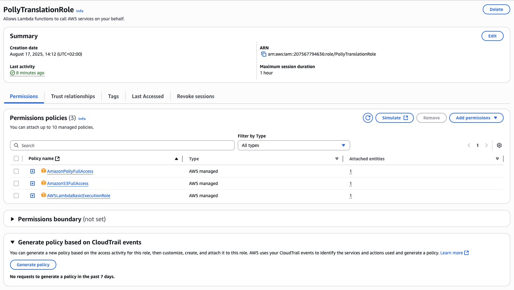
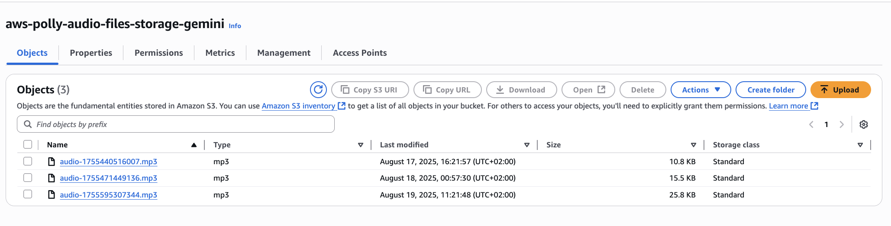
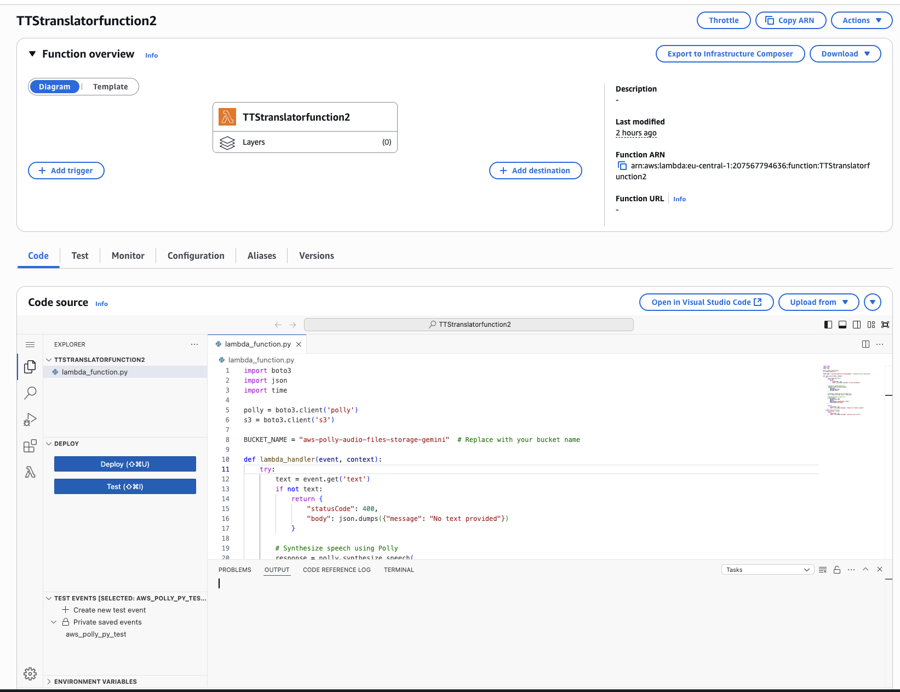
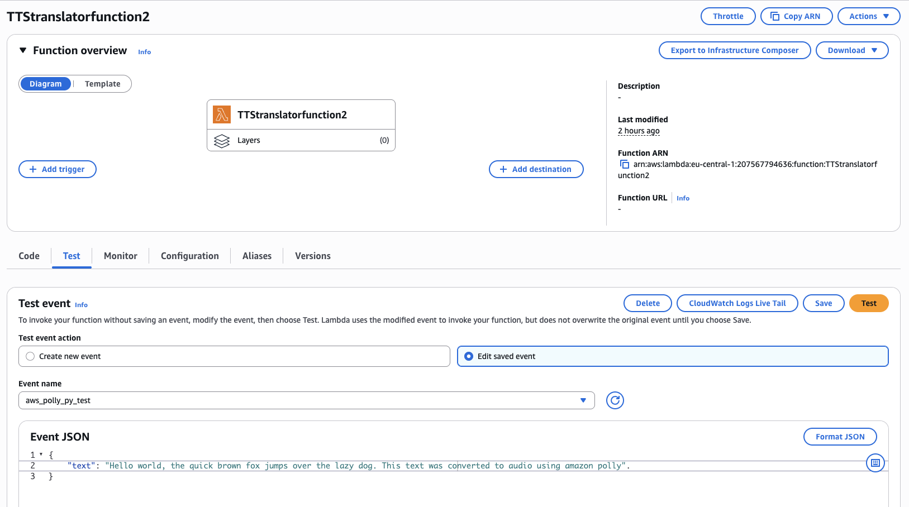
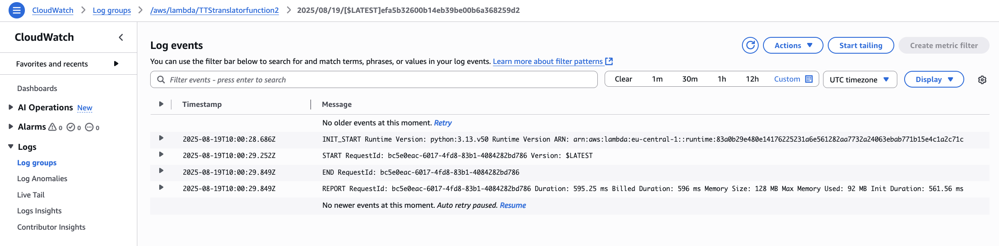

## IAM Role Setup
To enable the Lambda function to interact with Amazon Polly and store audio outputs in S3, an IAM role with proper permissions is required. In the AWS Management Console, create a new role with Lambda as the trusted entity and attach the following policies: **AmazonPollyFullAccess**, **AmazonS3FullAccess**, and **AWSLambdaBasicExecutionRole**. Assign a clear name and description to the role. This setup ensures the function has secure, least-privilege access to the services it needs, aligning with production-grade cloud best practices.

## Creating an S3 Bucket
To store the audio files generated by Amazon Polly, an S3 bucket is required. In the AWS Management Console, navigate to S3 → Create Bucket, provide a meaningful name, and leave the default settings. This bucket will serve as the storage location for all audio outputs, which are saved via the Lambda function. Setting up this bucket completes the foundation for a serverless text-to-speech workflow.

## Creating the Lambda Function
To process text and generate audio, a Lambda function is created in the AWS Management Console. Select **Python 3.13** as the runtime and attach the IAM role created earlier. 
The Lambda function can be found in this repository under the file named **lambda_function.py**
The function, saved as **lambda_function.py**, leverages the AWS SDK to interact with Amazon Polly for text-to-speech conversion and S3 for storing the resulting audio files. It accepts an input event containing a text field, validates the input, synthesizes speech using the "Joanna" voice, and uploads the audio to the specified S3 bucket with a unique timestamped filename. The function includes robust error handling, returning appropriate HTTP status codes for success or failure. This structure ensures a maintainable, production-ready serverless workflow.

## Testing and Verifying the Output
After configuring the Lambda function, we test it by creating a test event in the AWS Management Console. The test event includes a python3 payload with the text to convert, for example: 

**"text": "Hello world, the quick brown fox jumps over the lazy dog. This text was converted to audio using amazon polly"**.

 Once saved, the test event is invoked, and the function processes the input. The resulting audio file is then available in the previously created S3 bucket, where it can be accessed or downloaded. Successfully completing this step demonstrates a fully functional serverless text-to-speech pipeline using Amazon Polly, Lambda, and S3.

## Conclusion
This project demonstrates the design and implementation of a **fully serverless text-to-speech pipeline** using Amazon Polly, AWS Lambda, and S3. It highlights key cloud engineering skills, including **event-driven architecture, IAM-based security, and serverless workflow optimization**. The solution is **scalable, maintainable, and production-ready**, showcasing the ability to build real-world cloud applications that enhance accessibility and content delivery. This project serves as a strong example of applying **AWS cloud services to solve practical problems** efficiently and securely.
